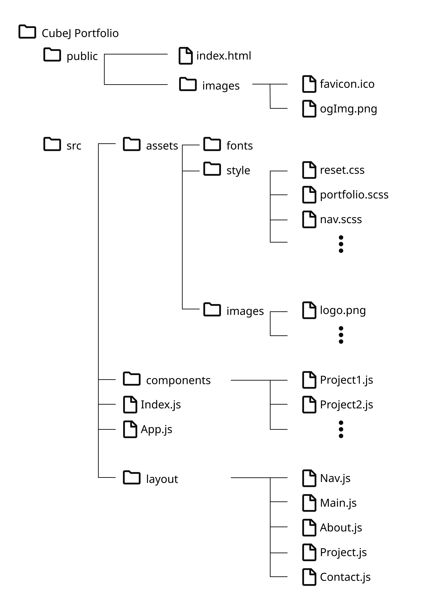

# 포트폴리오의 구성 및 설명

- 포트폴리오 주소 : <https://wkdwowns100.github.io/PortFolio/>

## 포트폴리오의 목적

포트폴리오 제작을 통해 간단한 자기소개 및 나의 기술을 소개

## 포트폴리오의 구성

### `디렉토리 구조`

</img>

- 리액트를 이용하여 layout>header, home, about, project, contact의
  5개 컴포넌트로 분리하여 작성, 그 외에 세부 컴포넌트 들은 components 내에 작성

## 사용한 기술

- React
- SCSS
- JavaScript
- NodeJS
- tool: GitHub(호스팅 및 백업), Visual Studio Code(문서작성 및 수정), Figma(와이어프레임 및 프로토타입 제작)

## 페이지 구성

- 1개의 페이지 안에 home, about, project, contact 의 4가지 구역으로 구성함

  ### `Home`

  - header영역에 Navigation 및 더보기 작성, 더보기를 통한 큰 화면의 Navigation의 경우 JS를 이용하여 클릭이벤트 사용
  - flex, position을 이용한 레이아웃 구성
  - SCSS를 이용한 3d 애니메이션 사용 및 JS를 이용한 마우스 이벤트

  ### `About`

  - 스크롤 이벤트를 이용한 오브젝트 이동
  - position을 이용한 위치 조정

  ### `Project`

  - 마우스 이벤트를 이용한 크기변경 및 외부링크
  - grid를 이용한 레이아웃 구성

  ### `Contact`

  - flex를 이용한 배치
  - SCSS를 이용한 마우스 hover 이벤트 및 외부링크

## 문제 및 해결

- full page scroll을 적용하고자 하였으나 일부 component의 세로 크기가 다르고 스크롤이벤트가 들어가 있어 쉽게 적용하지 못함
  - 다른 프로젝트에서 더 적절하게 적용해 볼 예정
- 마우스 좌표에 따른 이펙트를 넣고자 useEffect를 사용하였으나 작동하지 않았다.

```
  useEffect(() => {
    window.addEventListener("mousemove", (e) => {
      setPosX(e.clientX);
      setPosY(e.clientY);
      cubeTxt1.style.transform = `translate(${posX / 30}px, ${posY / 20}px)`;
      cubeTxt2.style.transform = `translate(${-posY / -20}px, ${posX / 40}px)`;
      cubeTxt3.style.transform = `translate(${30 - posX / 20}px, ${
        -posY / 20
      }px)`;
    });
    return window.removeEventListener("mousemove", (e) => {
      setPosX(e.clientX);
      setPosY(e.clientY);
      cubeTxt1.style.transform = `translate(${posX / 30}px, ${posY / 20}px)`;
      cubeTxt2.style.transform = `translate(${-posY / -20}px, ${posX / 40}px)`;
      cubeTxt3.style.transform = `translate(${30 - posX / 20}px, ${
        -posY / 20
      }px)`;
    });
  }, []);
```

- useCallback으로 변하는좌표를 콜백하여 해결하였다

```
useEffect(() => {
  window.addEventListener("mousemove", (e) => {
    setPosX(e.clientX);
    setPosY(e.clientY);
    cubeTxt1.style.transform = `translate(${posX / 30}px, ${posY / 20}px)`;
    cubeTxt2.style.transform = `translate(${-posY / -20}px, ${posX / 40}px)`;
    cubeTxt3.style.transform = `translate(${30 - posX / 20}px, ${
      -posY / 20
    }px)`;
  });
  return window.removeEventListener("mousemove", (e) => {
    setPosX(e.clientX);
    setPosY(e.clientY);
    cubeTxt1.style.transform = `translate(${posX / 30}px, ${posY / 20}px)`;
    cubeTxt2.style.transform = `translate(${-posY / -20}px, ${posX / 40}px)`;
    cubeTxt3.style.transform = `translate(${30 - posX / 20}px, ${
      -posY / 20
    }px)`;
  });
}, [posX, posY]);
```
